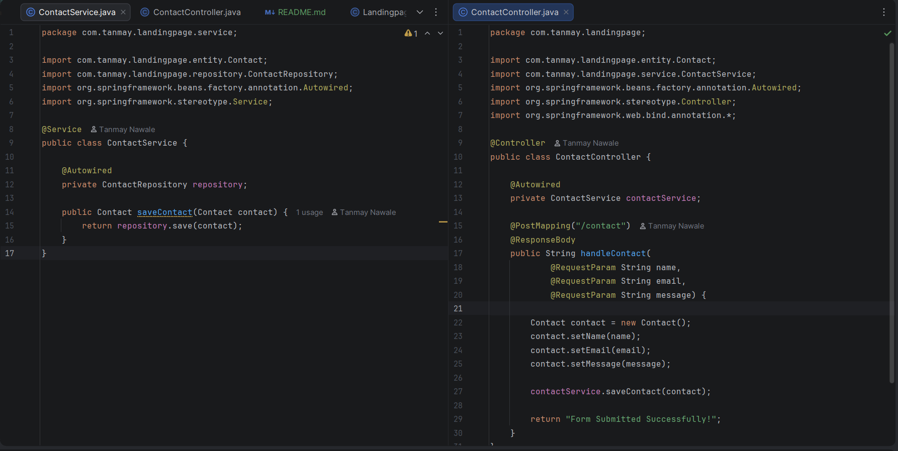

# 🚀 Landing Page with Spring Boot & MySQL

A responsive Landing Page application built using **Spring Boot**, **Spring Data JPA**, and **MySQL**. The project collects user contact details through a contact form and stores them in a MySQL database.

---

## 📌 Features

- Responsive Landing Page
- Contact Form
- Spring Boot Backend
- Spring Data JPA Integration
- MySQL Database Connectivity
- Stores Contact Details
- Clean MVC Architecture

---

## 🛠 Tech Stack

- Java 21
- Spring Boot 3.5.4
- Spring Data JPA
- MySQL
- Maven
- HTML5
- CSS3
- IntelliJ IDEA
- XAMPP (MySQL)

---

## 📂 Project Structure

```
landingpage
│── src
│   ├── main
│   │   ├── java
│   │   ├── resources
│── screenshots
│── pom.xml
│── README.md
```

---

## 📸 Screenshots

### Landing Page


### Source Code



### Form Submission


### Database (phpMyAdmin)


---

## ⚙️ Database Configuration

Update the `application.properties` file:

```properties
spring.datasource.url=jdbc:mysql://localhost:3306/landingdb
spring.datasource.username=root
spring.datasource.password=

spring.jpa.hibernate.ddl-auto=update
spring.jpa.show-sql=true
```

---

## ▶️ How to Run

1. Clone the repository

```bash
git clone https://github.com/codebytanmay/landingpage-tanmay.git
```

2. Open the project in IntelliJ IDEA

3. Configure MySQL and create the database:

```sql
CREATE DATABASE landingdb;
```

4. Update `application.properties`

5. Run the Spring Boot application

6. Open your browser:

```
http://localhost:8080
```

---

## 👨‍💻 Author

**Tanmay Navale**

- GitHub: https://github.com/codebytanmay

---

⭐ If you found this project useful, don't forget to star the repository!
